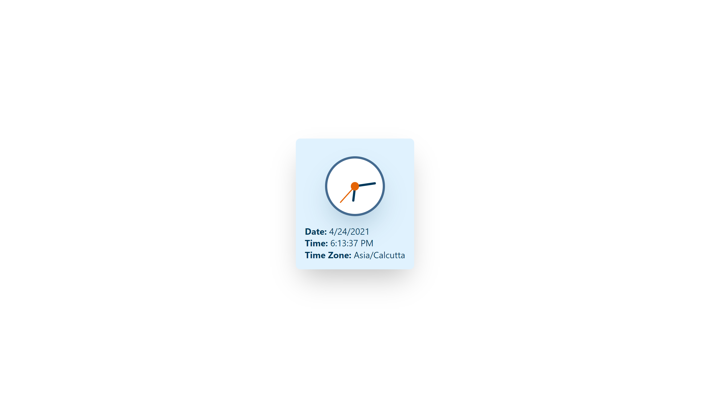

![Built With Stencil](https://img.shields.io/badge/-Built%20With%20Stencil-16161d.svg?logo=data%3Aimage%2Fsvg%2Bxml%3Bbase64%2CPD94bWwgdmVyc2lvbj0iMS4wIiBlbmNvZGluZz0idXRmLTgiPz4KPCEtLSBHZW5lcmF0b3I6IEFkb2JlIElsbHVzdHJhdG9yIDE5LjIuMSwgU1ZHIEV4cG9ydCBQbHVnLUluIC4gU1ZHIFZlcnNpb246IDYuMDAgQnVpbGQgMCkgIC0tPgo8c3ZnIHZlcnNpb249IjEuMSIgaWQ9IkxheWVyXzEiIHhtbG5zPSJodHRwOi8vd3d3LnczLm9yZy8yMDAwL3N2ZyIgeG1sbnM6eGxpbms9Imh0dHA6Ly93d3cudzMub3JnLzE5OTkveGxpbmsiIHg9IjBweCIgeT0iMHB4IgoJIHZpZXdCb3g9IjAgMCA1MTIgNTEyIiBzdHlsZT0iZW5hYmxlLWJhY2tncm91bmQ6bmV3IDAgMCA1MTIgNTEyOyIgeG1sOnNwYWNlPSJwcmVzZXJ2ZSI%2BCjxzdHlsZSB0eXBlPSJ0ZXh0L2NzcyI%2BCgkuc3Qwe2ZpbGw6I0ZGRkZGRjt9Cjwvc3R5bGU%2BCjxwYXRoIGNsYXNzPSJzdDAiIGQ9Ik00MjQuNywzNzMuOWMwLDM3LjYtNTUuMSw2OC42LTkyLjcsNjguNkgxODAuNGMtMzcuOSwwLTkyLjctMzAuNy05Mi43LTY4LjZ2LTMuNmgzMzYuOVYzNzMuOXoiLz4KPHBhdGggY2xhc3M9InN0MCIgZD0iTTQyNC43LDI5Mi4xSDE4MC40Yy0zNy42LDAtOTIuNy0zMS05Mi43LTY4LjZ2LTMuNkgzMzJjMzcuNiwwLDkyLjcsMzEsOTIuNyw2OC42VjI5Mi4xeiIvPgo8cGF0aCBjbGFzcz0ic3QwIiBkPSJNNDI0LjcsMTQxLjdIODcuN3YtMy42YzAtMzcuNiw1NC44LTY4LjYsOTIuNy02OC42SDMzMmMzNy45LDAsOTIuNywzMC43LDkyLjcsNjguNlYxNDEuN3oiLz4KPC9zdmc%2BCg%3D%3D&colorA=16161d&style=flat-square)


# Stencil Date Time Component

Simple web component to display Date, Time and Time Zone built with Stencil.




## About Stencil

Stencil is a compiler for building fast web apps using Web Components.

Stencil combines the best concepts of the most popular frontend frameworks into a compile-time rather than run-time tool.  Stencil takes TypeScript, JSX, a tiny virtual DOM layer, efficient one-way data binding, an asynchronous rendering pipeline (similar to React Fiber), and lazy-loading out of the box, and generates 100% standards-based Web Components that run in any browser supporting the Custom Elements v1 spec.

Stencil components are just Web Components, so they work in any major framework or with no framework at all.


## Usage

Include the below scripts in the `<head>` of your webpage or app.

```
<!-- For modern browsers with JS modules support -->
<script src="https://unpkg.com/stencil-date-time-component/dist/stencil-date-time-component/stencil-date-time-component.esm.js" type="module"></script>

<!-- Fallback script for older browsers that do not support JS modules -->
<script src="https://unpkg.com/stencil-date-time-component/dist/stencil-date-time-component/stencil-date-time-component.js" nomodule></script>
```

Then add the `date-time` web component snippet in your preferred place.

```
<date-time time-zone="Asia/Calcutta" should-update="true" show-clock="true"></date-time>
```


## Attributes

| Attribute       | Description                                                                       | Type      | Default                                            |
| --------------- | --------------------------------------------------------------------------------- | --------- | -------------------------------------------------- |
| `should-update` | Should the time keep updating.                                                    | `boolean` | `false`                                            |
| `show-clock`    | Should the clock be shown.                                                        | `boolean` | `false`                                            |
| `time-zone`     | Timezone in which the date and time should be shown.                              | `string`  | `Browser Timezone`                                 |


## Browser Support

| Browser           | Support                         |
|-------------------|---------------------------------|
| Chrome 60+        | Full native support             |
| Firefox 63+       | Full native support             |
| Safari 10.1+      | Full native support             |
| Edge 79+          | Full native support             |
| IE 11, Edge 16-18 | Support with bundled polyfills  |
| IE 10-6           | Not Supported                   |

