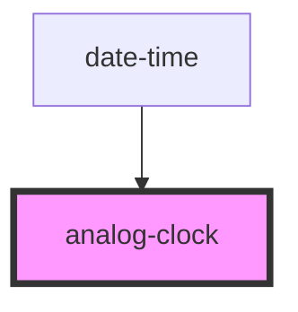

# analog-clock

<!-- Auto Generated Below -->

## Properties

| Property   | Attribute   | Description                                                                       | Type     | Default                                            |
| ---------- | ----------- | --------------------------------------------------------------------------------- | -------- | -------------------------------------------------- |
| `time`     | `time`      | Time to be displayed in the clock.                                                | `number` | `Date.now()`                                       |
| `timeZone` | `time-zone` | Timezone in which the date and time should be shown. Default is browser timezone. | `string` | `Intl.DateTimeFormat().resolvedOptions().timeZone` |

## Dependencies

### Used by

 - [date-time](../date-time)

### Graph

----------------------------------------------

*Built with [StencilJS](https://stenciljs.com/)*
