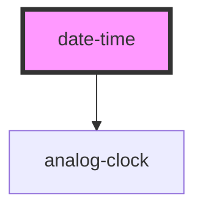

# date-time

<!-- Auto Generated Below -->

## Properties

| Property       | Attribute       | Description                                                                       | Type      | Default                                            |
| -------------- | --------------- | --------------------------------------------------------------------------------- | --------- | -------------------------------------------------- |
| `shouldUpdate` | `should-update` | Should the time keep updating. Default is `false`                                 | `boolean` | `false`                                            |
| `showClock`    | `show-clock`    | Should the clock be shown. Default is `false`                                     | `boolean` | `false`                                            |
| `timeZone`     | `time-zone`     | Timezone in which the date and time should be shown. Default is browser timezone. | `string`  | `Intl.DateTimeFormat().resolvedOptions().timeZone` |

## Dependencies

### Depends on

- [analog-clock](../analog-clock)

### Graph

----------------------------------------------

*Built with [StencilJS](https://stenciljs.com/)*
